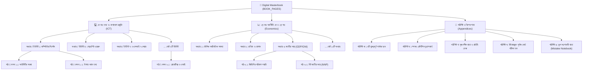

# 📚 পরীক্ষা প্রস্তুতি ও ডিজিটাল মাস্টারবুক (Exam Prep & Digital Masterbook)
### জাতীয় শিক্ষাক্রম (NCTB) অনুযায়ী আইসিটি ও অর্থনীতি ১০০/১০০ পূর্ণাঙ্গ প্রস্তুতি প্ল্যাটফর্ম

[](https://study4xm.web.app)
[](https://reactjs.org/)
[](https://vitejs.dev/)
[](https://study4xm.web.app)

---

## 📖 সারসংক্ষেপ (Overview)

এই প্ল্যাটফর্মটি বাংলাদেশের জাতীয় শিক্ষাক্রম ও পাঠ্যপুস্তক বোর্ড (NCTB) অনুমোদিত **তথ্য ও যোগাযোগ প্রযুক্তি (ICT)** এবং **অর্থনীতি ১ম ও ২য় পত্র (Economics)** বিষয়ের পূর্ণাঙ্গ ডিজিটাল মাস্টারবুক। গতানুগতিক স্ট্যাটিক ওয়েব পেজের পরিবর্তে এটি একটি বাস্তবসম্মত ডিজিটাল বইয়ের অভিজ্ঞতা প্রদান করে, যেখানে রয়েছে থ্রি-ডি পেজ ফ্লিপ, ড্র্যাগ/সোয়াইপ নেভিগেশন, অডিও টিউটর, ৫-লেভেল শিক্ষণ পদ্ধতি, ইন্টারঅ্যাক্টিভ সিমুলেটর এবং অফলাইন-ফার্স্ট লোকাল স্টোরেজ ট্র্যাকিং।

* **🌐 লাইভ ওয়েবসাইট**: [https://study4xm.web.app](https://study4xm.web.app)
* **🔥 ফায়ারবেস প্রজেক্ট**: `portfolio-sany` (হোস্টিং সাইট: `study4xm`)

---

## 🏗️ মূল ডেটা স্ট্রাকচার (Data Hierarchy Architecture)

অ্যাপ্লিকেশনটির ডেটা মডেল কঠোরভাবে **`Subject -> Chapters / Units -> Lessons / Topics`** হায়ারার্কি অনুসরণ করে:



---

## 🎯 ৫-লেভেল শিক্ষণ পদ্ধতি (5-Level Learning System per Lesson)

প্রতিটি পাঠ বা লেসনের বিষয়বস্তু বোর্ড পরীক্ষায় পূর্ণ নম্বর (১০০/১০০) অর্জনের লক্ষ্যে ৫টি ধাপে সাজানো:

1. **লেভেল ১: প্রাথমিক ধারণা ও মূল উপলব্ধি (Core Concept & Syllabus Outline)**
   * সহজ বাংলায় মূল ধারণার রূপরেখা (`simpleIdea`).
   * অতি সহজ কথোপকথনমূলক ব্যাখ্যা (`simplerVersion`) টগল বাটন সহ।
   * জাতীয় শিক্ষাক্রম অনুযায়ী মূল পাঠ্যবইয়ের বিশদ রূপরেখা (`banglaExplanation`).
2. **লেভেল ২: পরীক্ষার জন্য আবশ্যকীয় শব্দকোষ (Key Terminology & Keywords)**
   * পারিভাষিক শব্দ ও নির্ভুল সংজ্ঞার গ্রিড (`keywords`: `term` + `def`).
3. **লেভেল ৩: প্রযুক্তিগত কার্যপদ্ধতি ও বাস্তব উদাহরণ (Technical Mechanics & Labs)**
   * প্রযুক্তিগত প্রক্রিয়া ও সমীকরণ (`technicalExplanation`).
   * বাস্তব জীবনের প্রাসঙ্গিক উদাহরণ (`realLifeExample`).
   * টপিক-ভিত্তিক লাইভ ইন্টারঅ্যাক্টিভ ল্যাব (যেমন: এক্সেল রানার, ওএসআই লেয়ার, চাহিদা-যোগান ক্যানভাস)।
4. **লেভেল ৪: বোর্ড পরীক্ষার লিখিত উত্তরের কাঠামো (Board Exam Answer Templates)**
   * ২ নম্বরের অনুধাবনমূলক আদর্শ উত্তর (`twoMark`).
   * ৫/৩ নম্বরের প্রয়োগমূলক উত্তর (`fiveMark`).
   * ১০/৪ নম্বরের উচ্চতর দক্ষতামূলক পূর্ণাঙ্গ সৃজনশীল উত্তর (`tenMark`).
5. **লেভেল ৫: তাৎক্ষণিক যাচাই ও সক্রিয় স্মরণ (Assessment & Active Recall)**
   * অবজেক্টিভ চেকপয়েন্ট কুইজ (`mcqs`) সঠিক/ভুল ব্যাখ্যা সহ।
   * না দেখে নিজের ভাষায় লেখার অ্যাক্টিভ রিকল নোটপ্যাড (`notepad-textarea`).
   * স্বয়ংক্রিয় ভুল ট্র্যাকিং যা ভুলগুলোকে সরাসরি "ভুল সংশোধনী খাতা"-য় যুক্ত করে।

---

## 🧪 ইন-বুক ইন্টারঅ্যাক্টিভ সিমুলেটরসমূহ (Embedded Simulators)

| সিমুলেটর | ফাইল পাথ | কার্যপদ্ধতি |
| :--- | :--- | :--- |
| **লাইভ স্প্রেডশিট ল্যাব** | [`src/components/interactive/ExcelSimulator.jsx`](file:///c:/All/works/tisha-exams/src/components/interactive/ExcelSimulator.jsx) | রিয়েল-টাইম সেল এডিটিং, `=SUM`, `=AVERAGE`, `=MAX`, `=MIN` ফর্মুলা পার্সিং |
| **OSI ৭-লেয়ার ভিজ্যুয়ালাইজার** | [`src/components/interactive/OSIVisualizer.jsx`](file:///c:/All/works/tisha-exams/src/components/interactive/OSIVisualizer.jsx) | অ্যাপ্লিকেশন থেকে ফিজিক্যাল লেয়ার পর্যন্ত প্যাকেট এনক্যাপসুলেশন ও অডিও ভয়েস ব্যাখ্যা |
| **স্লাইড ট্রানজিশন বিল্ডার** | [`src/components/interactive/PowerPointBuilder.jsx`](file:///c:/All/works/tisha-exams/src/components/interactive/PowerPointBuilder.jsx) | স্লাইড তৈরি, অ্যানিমেশন টাইমলাইন ও লাইভ প্লেয়ার |
| **সাইবার নিরাপত্তা ডিসিশন ট্রি** | [`src/components/interactive/CyberScenario.jsx`](file:///c:/All/works/tisha-exams/src/components/interactive/CyberScenario.jsx) | ফিশিং, র‌্যানসমওয়্যার ও টু-ফ্যাক্টর অথেনটিকেশনের লাইভ সিনারিও টেস্ট |
| **চাহিদা ও যোগান ভারসাম্য ক্যানভাস** | [`src/components/interactive/SupplyDemandCanvas.jsx`](file:///c:/All/works/tisha-exams/src/components/interactive/SupplyDemandCanvas.jsx) | HTML5 ক্যানভাসে দাম (P) ও পরিমাণ (Q) পরিবর্তনের সাথে সাথে ভারসাম্য রেখাচিত্রের ডাইনামিক শিফট |

---

## 🧭 গাইডেড ট্যুর সিস্টেম (Interactive SVG Mask Onboarding Tour)

নতুন ব্যবহারকারীদের জন্য অ্যাপটিতে একটি অত্যাধুনিক অনবোর্ডিং গাইড ট্যুর অন্তর্ভুক্ত রয়েছে:
* **ফাইল**: [`src/components/GuidedTour.jsx`](file:///c:/All/works/tisha-exams/src/components/GuidedTour.jsx)
* **আর্কিটেকচার**: SVG Mask Cutout (`<mask id="tour-spotlight-cutout">`) ব্যবহার করা হয়েছে।
* **বৈশিষ্ট্য**: 
  * টার্গেট এলিমেন্টের ওপর কোনো ঘোলা বা অন্ধকার আবরণ থাকে না; টার্গেট বোতামটি ১০০% উজ্জ্বল ও তীক্ষ্ণ থাকে।
  * চারদিকে একটি লুমিনাস পিংক স্পটলাইট রিং ও পালসিং অ্যানিমেশন প্রদর্শিত হয়।
  * প্রথমবার আগত ভিজিটরদের জন্য স্বয়ংক্রিয় ওয়েলকাম টোস্ট।
  * হেডারে **"🧭 গাইড"** বোতামে চাপ দিয়ে যেকোনো সময় পুনরায় ট্যুর চালু করা যায়।
  * "বাদ দিন" (Skip), "পূর্ববর্তী", "পরবর্তী" এবং কিবোর্ড শর্টকাট (`←`, `→`, `Esc`) সাপোর্ট।

---

## 📂 ফাইল ও ফোল্ডার বিন্যাস (Directory Layout)

```text
tisha-exams/
├── index.html                     # প্রধান HTML ও Google Fonts (Hind Siliguri, Outfit)
├── package.json                   # প্রজেক্ট ডিপেনডেন্সি ও স্ক্রিপ্টসমূহ
├── vite.config.js                 # Vite কনফিগারেশন (React প্লাগইন সহ)
├── firebase.json                  # ফায়ারবেস হোস্টিং রুল ও রিরাইট কনফিগ
├── .firebaserc                    # ফায়ারবেস প্রজেক্ট ম্যাপিং (portfolio-sany)
│
├── src/
│   ├── main.jsx                   # React DOM রুট মাউন্ট
│   ├── App.jsx                    # মূল রুট কনটেইনার ও থিম সিঙ্ক
│   ├── index.css                  # গ্লোবাল সিএসএস, ডার্ক মোড প্যালেট ও বুক স্টাইলিং
│   │
│   ├── data/                      # 📚 ডেটা লেয়ার (Subject -> Chapters -> Lessons)
│   │   ├── bookPages.js           # মাস্টার পেজ অ্যারে (১ থেকে ২৮ পৃষ্ঠা পর্যন্ত ডেক বিল্ডার)
│   │   ├── ictData.js             # ১ম খণ্ড: আইসিটি ৯টি ইউনিটের ডেটা ও প্রশ্নব্যাংক
│   │   ├── economicsData.js       # ২য় খণ্ড: অর্থনীতি ১০টি অধ্যায়ের ডেটা ও সমাধান
│   │   └── differencesData.js     # ১৭টি হাই-ইল্ড বোর্ড পার্থক্য ম্যাট্রিক্স
│   │
│   ├── hooks/                     # ⚙️ স্টেট ও অডিও কন্ট্রোলার
│   │   ├── useAppState.js         # লোকাল স্টোরেজ সিঙ্ক, অগ্রগতি ট্র্যাকার, কুইজ ও মিস্টেক হ্যান্ডলার
│   │   └── useAudio.js            # Web Audio API সিন্থেসাইজার ও Web Speech TTS
│   │
│   └── components/                # 🧩 ভিউ ও ইন্টারঅ্যাক্টিভ উপাদানসমূহ
│       ├── BookLayout.jsx         # মূল বই ফ্রেমওয়ার্ক, হেডার, বটম ডক ও ড্র্যাগ/সোয়াইপ ইঞ্জিন
│       ├── BookPage.jsx           # ৫-লেভেল লেসন রেন্ডারার ও অ্যাক্টিভ রিকল নোটপ্যাড
│       ├── TableOfContents.jsx    # স্লাইড-আউট সূচিপত্র ড্রয়ার ও দ্রুত কোর্স সুইচ
│       ├── GuidedTour.jsx         # এসভিজি মাস্কভিত্তিক ইন্টারেক্টিভ স্পটলাইট ট্যুর
│       ├── DifferenceTablesView.jsx # পার্থক্য ছক ভিউয়ার
│       ├── FlashcardsView.jsx     # স্পেসড রেপিটিশন (SRS) ফ্ল্যাশকার্ড ডেক
│       ├── WritingTrainerView.jsx # লিখিত সৃজনশীল উত্তরের কাঠামো ও স্ব-মূল্যায়ন
│       ├── ExamSimulatorView.jsx  # ১০০ নম্বরের টাইমারযুক্ত বোর্ড পরীক্ষা হল
│       ├── MistakeNotebookView.jsx# ভুল সংশোধনী খাতা (রিভিশন ট্র্যাকার)
│       ├── SpacedRevisionView.jsx # সময় অনুযায়ী রিভিশন শিডিউলার
│       │
│       └── interactive/           # 🧪 ৫টি লাইভ ইন্টারঅ্যাক্টিভ ল্যাব
│           ├── ExcelSimulator.jsx
│           ├── OSIVisualizer.jsx
│           ├── PowerPointBuilder.jsx
│           ├── CyberScenario.jsx
│           └── SupplyDemandCanvas.jsx
```

---

## 🛠️ নতুন ডেটা ও ফিচার যুক্ত করার নির্দেশিকা (Developer Guide)

### ১. নতুন পাঠ/লেসন যুক্ত করা (Adding a New Lesson)

একটি নতুন লেসন যুক্ত করতে [`src/data/ictData.js`](file:///c:/All/works/tisha-exams/src/data/ictData.js) অথবা [`src/data/economicsData.js`](file:///c:/All/works/tisha-exams/src/data/economicsData.js)-এর সংশ্লিষ্ট অধ্যায়ের `topics` বা `concepts` অ্যারেতে নিচের স্কিমায় অবজেক্ট যুক্ত করুন:

```javascript
{
  id: "ict-u1-t3", // অনন্য ইউনিক আইডি
  title: "উপাত্ত ও তথ্যের মধ্যে পার্থক্য (Data vs Information)",
  priority: 5,     // ১ থেকে ৫ স্টার গুরুত্ব
  simpleIdea: "উপাত্ত হলো কাঁচামাল, আর তথ্য হলো প্রক্রিয়াজাত অর্থপূর্ণ ফল।",
  simplerVersion: "যেমন: '৮০, ৯০, ৮৫' হলো উপাত্ত। কিন্তু 'রকিবের পরীক্ষার নম্বর ৮০, ৯০, ৮৫' হলো তথ্য।",
  banglaExplanation: "উপাত্ত হলো কোনো প্রক্রিয়াকরণ ব্যতীত বিচ্ছিন্ন উপাদান। উপাত্তকে যখন নির্দিষ্ট প্রক্রিয়াকরণের মাধ্যমে ব্যবহারযোগ্য ও অর্থবহ করা হয়, তখন তাকে তথ্য বলে।",
  keywords: [
    { term: "উপাত্ত (Data)", def: "তথ্যের ক্ষুদ্রতম কাঁচামাল যা এককভাবে কোনো পূর্ণাঙ্গ অর্থ প্রকাশ করতে পারে না।" },
    { term: "তথ্য (Information)", def: "অর্থপূর্ণ প্রক্রিয়াজাত উপাত্ত যা সিদ্ধান্ত গ্রহণে সহায়তা করে।" }
  ],
  technicalExplanation: "ডেটাবেজে রেকর্ড ও ফিল্ডের সমন্বয়ে ডেটা সঞ্চিত হয়। অ্যালগরিদম ও কুয়েরি প্রক্রিয়াকরণের মাধ্যমে ডেটা ইনফরমেশনে রূপান্তরিত হয়।",
  realLifeExample: "ভোটার তালিকায় প্রতিটি নাগরিকের আঙুলের ছাপ ও ছবি হলো উপাত্ত, আর তৈরি হওয়া স্মার্ট জাতীয় পরিচয়পত্র হলো তথ্য।",
  examAnswers: {
    twoMark: "উপাত্ত ও তথ্যের মধ্যে দুটি পার্থক্য লিখুন:\n১. উপাত্ত কোনো অর্থ প্রকাশ করতে পারে না, কিন্তু তথ্য পূর্ণ অর্থ প্রকাশ করে।\n২. উপাত্ত প্রক্রিয়াকরণের পূর্ববর্তী রূপ, আর তথ্য হলো প্রক্রিয়াকরণের পরবর্তী ফলাফল।",
    fiveMark: "উপাত্ত ও তথ্যের সম্পর্ক ও এদের রূপান্তর প্রক্রিয়া চিত্রসহ ব্যাখ্যা করো...",
    tenMark: "তথ্যপ্রযুক্তির যুগে নির্ভরযোগ্য তথ্যের গুরুত্ব ও উপাত্ত ব্যবস্থাপনার ভূমিকা বিশদ আলোচনা করো..."
  },
  commonMistakes: "উপাত্তকে তথ্যের চেয়ে বড় মনে করা একটি ভুল ধারণা; উপাত্ত প্রক্রিয়াজাত হয়েই তথ্য তৈরি হয়।",
  recallQuestion: "উপাত্ত ও তথ্যের মূল ৩টি পার্থক্য স্মৃতি থেকে লিখুন:",
  mcqs: [
    {
      question: "নিচের কোনটি প্রক্রিয়াজাত উপাত্তের রূপ?",
      options: ["উপাত্ত", "তথ্য", "সংকেত", "অ্যালগরিদম"],
      correct: 1,
      difficulty: "সহজ",
      explanation: "উপাত্তকে প্রক্রিয়াকরণ করলেই তা অর্থপূর্ণ তথ্যে পরিণত হয়।"
    }
  ]
}
```

> **নোট**: ডেটা যুক্ত করার সাথে সাথেই [`src/data/bookPages.js`](file:///c:/All/works/tisha-exams/src/data/bookPages.js)-এর লুপ স্বয়ংক্রিয়ভাবে নতুন পৃষ্ঠা নম্বর অ্যাসাইন করে ফেলবে এবং সূচিপত্র ও পেজিনেশনে আপডেট হয়ে যাবে।

---

### ২. নতুন বিষয় যুক্ত করা (Adding a New Subject, e.g., Physics or Accounting)

1. `src/data/` ফোল্ডারে নতুন ফাইল তৈরি করুন (যেমন: `physicsData.js`)।
2. [`src/data/bookPages.js`](file:///c:/All/works/tisha-exams/src/data/bookPages.js)-এ নতুন সিলেবাস ইমপোর্ট করে `BOOK_PAGES` লুপে যোগ করুন:
   ```javascript
   PHYSICS_SYLLABUS.forEach(unit => {
     unit.topics.forEach(topic => {
       BOOK_PAGES.push({
         pageNumber: pageCounter++,
         type: 'chapter',
         subject: 'Physics',
         volume: '৩য় খণ্ড: পদার্থবিজ্ঞান',
         chapterTitle: unit.unitTitle,
         topic: topic,
         priority: topic.priority || 5,
         section: `অধ্যায় ${unit.unitId}`
       });
     });
   });
   ```
3. [`src/components/TableOfContents.jsx`](file:///c:/All/works/tisha-exams/src/components/TableOfContents.jsx) এবং [`src/components/BookLayout.jsx`](file:///c:/All/works/tisha-exams/src/components/BookLayout.jsx)-এ নতুন বিষয়ের সুইচ বোতাম যোগ করুন।

---

### ৩. নতুন ইন্টারঅ্যাক্টিভ ল্যাব বা সিমুলেটর তৈরি করা (Adding an Interactive Simulator)

1. `src/components/interactive/` ডিরেক্টরিতে একটি নতুন কম্পোনেন্ট তৈরি করুন (যেমন: `LogicGateSimulator.jsx`)।
2. [`src/components/BookPage.jsx`](file:///c:/All/works/tisha-exams/src/components/BookPage.jsx)-এ শর্ত অনুযায়ী ইমপোর্ট ও রেন্ডার করুন:
   ```jsx
   {topic.id === 'ict-u3-t1' && (
     <div className="book-lab-container">
       <div className="lab-title-row">
         <h4 style={{ fontSize: '1rem', fontWeight: 800 }}>ইন্টারেক্টিভ ল্যাব: লজিক গেট ট্রুথ টেবিল রানার</h4>
         <span className="lab-tag">হাতে-কলমে ল্যাব</span>
       </div>
       <LogicGateSimulator onChime={onChime} />
     </div>
   )}
   ```

---

## 💻 লোকাল ডেভেলপমেন্ট ও বিল্ড কমান্ডসমূহ (Running Locally)

### ১. ডিপেনডেন্সি ইনস্টল করুন
```bash
npm install
```

### ২. ডেভেলপমেন্ট সার্ভার চালু করুন
```bash
npm run dev
```
ব্রাউজারে ডিফল্ট পোর্ট `http://localhost:5173` ওপেন হবে।

### ৩. প্রোডাকশন বিল্ড তৈরি করুন
```bash
npm run build
```
এটি `dist/` ফোল্ডারে অপ্টিমাইজড এইচটিএমএল, সিএসএস এবং জেএস বান্ডেল তৈরি করবে।

### ৪. ফায়ারবেস হোস্টিংয়ে ডিপ্লয় করুন
```bash
npx firebase deploy --only hosting:study4xm --project portfolio-sany
```
সরাসরি লাইভ ইউআরএল: **`https://study4xm.web.app`** এ পরিবর্তন প্রতিফলিত হবে।

---

## 🎨 থিম ও স্টাইলিং সিস্টেম (Warm Rose Academic Aesthetic)

* **লাইট মোড (Creamy Warm Rose Parchment)**:
  * `--rose-50`: `#fff5f7`, `--rose-100`: `#ffe4e9`, `--rose-600`: `#e11d48`, `--text-ink`: `#2e0d16`.
* **ডার্ক মোড (Deep Dark Rose & High Contrast)**:
  * `--book-bg`: `#12070b`, `--page-bg`: `#1c0a10`, `--rose-50`: `#270f17`, `--text-ink`: `#fff0f3`.
* **টাইপোগ্রাফি**:
  * বাংলা পাঠ ও হেডারের জন্য Google Font: **`'Hind Siliguri'`** (যুক্তবর্ণ ও স্বরচিহ্নের নির্ভুল রেন্ডারিং)।
  * ইংরেজি টেক্সট ও সংখ্যার জন্য: **`'Outfit'`** ও **`'Crimson Pro'`**।

---

## 👨‍💻 অবদান ও লাইসেন্স (License & Maintenance)

প্রজেক্টটি শিক্ষার্থীবান্ধব ও জাতীয় শিক্ষাক্রমের পূর্ণাঙ্গ সহায়িকা হিসেবে তৈরি করা হয়েছে। কোনো নতুন অধ্যায়, অনুশীলন প্রশ্ন বা ইন্টারঅ্যাক্টিভ ভিজ্যুয়ালাইজার যুক্ত করতে চাইলে পিআর (Pull Request) পাঠাতে পারেন।
